# ha-light-scenes

## Description

Home Assistant script blueprints for applying light scenes to selected lights, devices, or areas. The base blueprint lets you configure colors manually; the preset blueprints provide ready-made Hue-style palettes.

## Modulo Room Light Colors

`Modulo Room Light Colors` is the base blueprint for custom light scenes. Select target lights, devices, or areas, define the colors manually, and the script applies them across the selected lights.

## Presets

| Grafik                                                                                 | Preset             | Import                                                                                                                                                                                                                                                                                                                                   |
| -------------------------------------------------------------------------------------- | ------------------ | ---------------------------------------------------------------------------------------------------------------------------------------------------------------------------------------------------------------------------------------------------------------------------------------------------------------------------------------- |
| 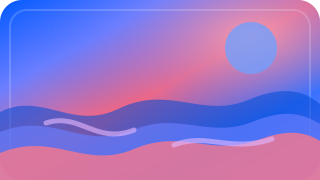                         | Adrift             |              |
|                | Amber bloom        |         |
|                | Amber robin        |         |
|        | Amethyst valley    |     |
| 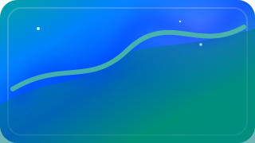           | Arctic aurora      |       |
| 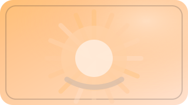                           | Arise              |               |
|                | Autumn gold        |         |
|             | Baby's breath      |        |
| 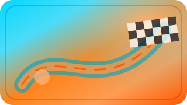                       | Bahrain            |             |
| 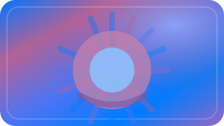                 | Beginnings         |          |
| 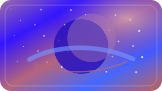                 | Blood moon         |          |
|                        | Blossom            |             |
| 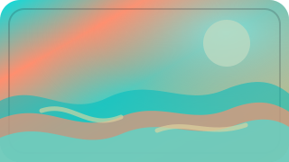               | Blue lagoon        |         |
| 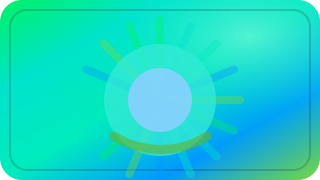               | Blue planet        |         |
|                          | Bright             |              |
|                          | Cancun             |              |
|                                | CGA                |                 |
|                    | Chinatown          |           |
|              | City of love       |        |
|          | Coastal nights     |      |
| 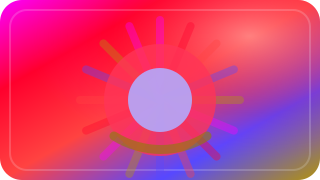               | Color burst        |         |
|                | Concentrate        |         |
|                | Cool bright        |         |
|                          | Crocus             |              |
| 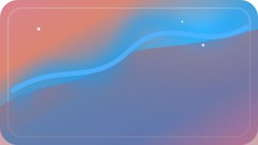               | Crystalline        |         |
| 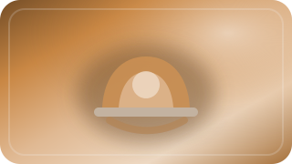                         | Dimmed             |              |
|                    | Disturbia          |           |
| 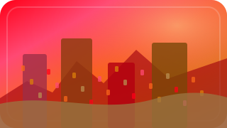     | Downtown drizzle   |    |
| 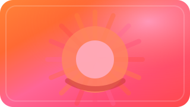               | Dreamy dusk        |         |
| 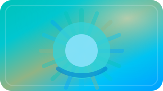       | Emerald flutter    |     |
| 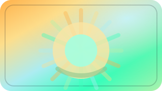             | Emerald isle       |        |
|                      | Energize           |            |
| 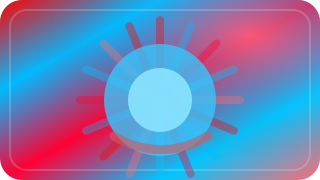                       | Fairfax            |             |
|              | Fall harvest       |        |
|                | Festive fun        |         |
| 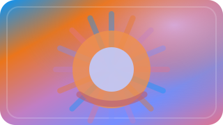               | First light        |         |
|      | Forest adventure   |    |
| 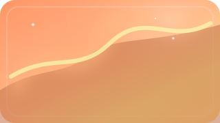               | Frosty dawn        |         |
| 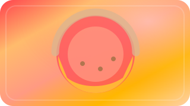       | Fruity popsicle    |     |
|                          | Galaxy             |              |
| 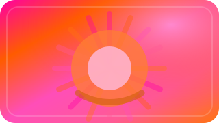         | Glitz and glam     |      |
|            | Glowing grins      |       |
|                | Golden pond        |         |
|                | Golden star        |         |
|                                | Hal                |                 |
|                    | Hazy days          |           |
|                | Hocus pocus        |         |
|                      | Honolulu           |            |
| 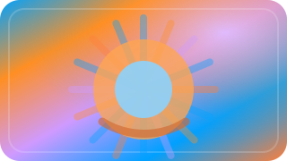                       | Horizon            |             |
|                            | Ibiza              |               |
|            | Island warmth      |       |
|                            | Jolly              |               |
| 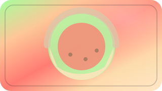     | Juicy watermelon   |    |
| 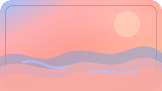                   | Lake mist          |           |
| 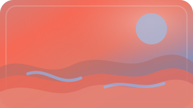               | Lake Placid        |         |
|              | Light Cycles       |        |
|                              | Lily               |                |
|                    | Lovebirds          |           |
|                        | Magneto            |             |
| 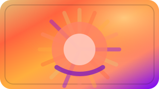     | Majestic morning   |    |
| 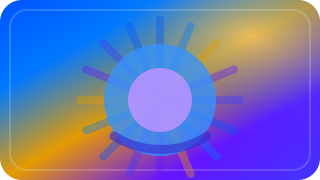                       | Memento            |             |
| 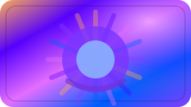                       | Meriete            |             |
| 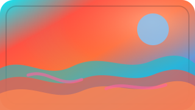                         | Miami              |             |
| 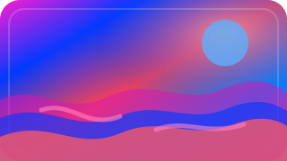                           | Miami              |               |
|            | Midsummer sun      |       |
|                    | Midwinter          |           |
|                | Misty ridge        |         |
|                    | Moonlight          |           |
|                          | Motown             |              |
|        | Mountain breeze    |     |
|                      | Narcissa           |            |
|                          | Nebula             |              |
|                  | Nightlight         |          |
|                    | Nighttime          |           |
| 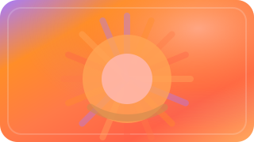           | November haze      |       |
|                  | Nutcracker         |          |
| 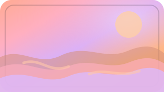                 | Ocean dawn         |          |
| 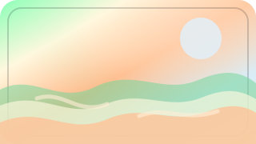             | Ocean escape       |        |
|            | Orange fields      |       |
| 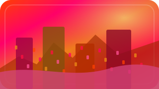                           | Osaka              |               |
| 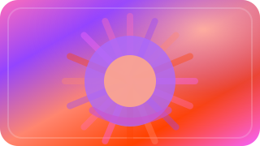               | Painted sky        |         |
| 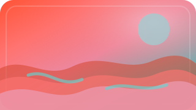                 | Palm Beach         |          |
|                | Pandemonium        |         |
| 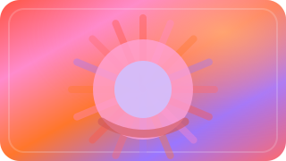                       | Pensive            |             |
|                        | Phantom            |             |
| 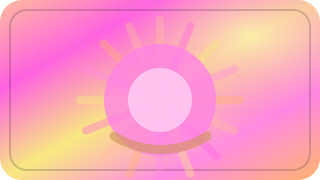                     | Precious           |            |
|                        | Promise            |             |
|            | Pumpkin patch      |       |
|            | Pumpkin spice      |       |
|                              | Read               |                |
|                            | Relax              |               |
| 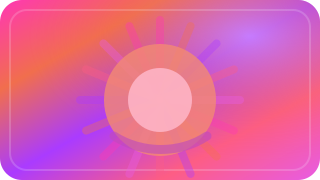               | Resplendent        |         |
|                              | Rest               |                |
| 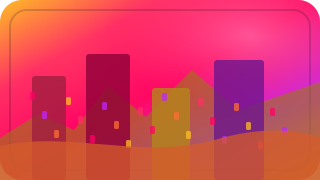                               | Rio                |                 |
|            | Rolling hills      |       |
| 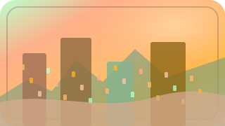                             | Rome               |                |
|              | Rosy sparkle       |        |
|                    | Ruby glow          |           |
|              | Ruby romance       |        |
| 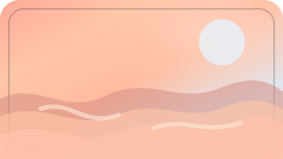             | Sailing away       |        |
| 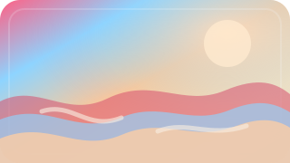                   | Santorini          |           |
|                    | São Paulo          |           |
|          | Savanna sunset     |      |
| 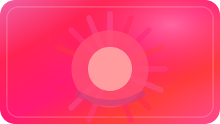           | Scarlet dream      |       |
|                            | SECAM              |               |
| 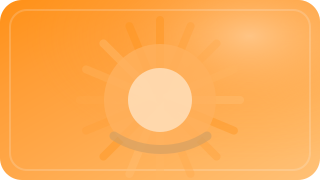                           | Shine              |               |
|              | Silent night       |        |
| 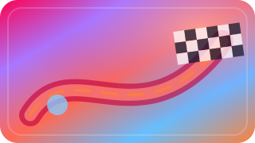               | Silverstone        |         |
|                    | Singapore          |           |
|                          | Sleepy             |              |
|                        | Smitten            |             |
| 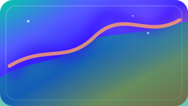             | Snow sparkle       |        |
| 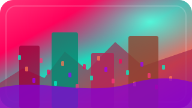                             | Soho               |                |
| 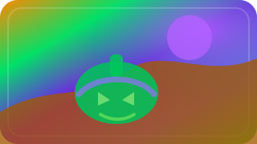                 | Spellbound         |          |
|          | Spring blossom     |      |
|                | Spring lake        |         |
|                    | Starlight          |           |
| 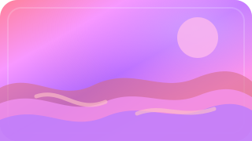             | Still waters       |        |
|                    | Storybook          |           |
| 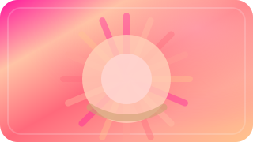           | Summer splash      |       |
|          | Sunday morning     |      |
|                        | Sundown            |             |
|                      | Sunflare           |            |
|            | Sunset allure      |       |
|                          | Suzuka             |              |
|      | Toil and trouble   |    |
|                            | Tokyo              |               |
|          | Trick or treat     |      |
|    | Tropical twilight  |   |
|                          | Tyrell             |              |
|          | Under the tree     |      |
|                          | Unwind             |              |
|                      | Valetudo           |            |
|                | Valley dawn        |         |
|                  | Vapor wave         |          |
|              | Warm embrace       |        |
|            | Winter beauty      |       |
|        | Winter mountain    |     |
|            | Witching hour      |       |
|  | Woodland toadstool |  |
|                    | Zandvoort          |           |

## License and Third-Party Usage

This project is licensed under the MIT License. See [LICENSE](LICENSE).

Preset data is derived from [hass-scene_presets](https://github.com/Hypfer/hass-scene_presets) by Hypfer and is licensed under the Apache License 2.0. See [THIRD_PARTY_NOTICES.md](THIRD_PARTY_NOTICES.md) and [THIRD_PARTY_LICENSES/Apache-2.0.txt](THIRD_PARTY_LICENSES/Apache-2.0.txt).
